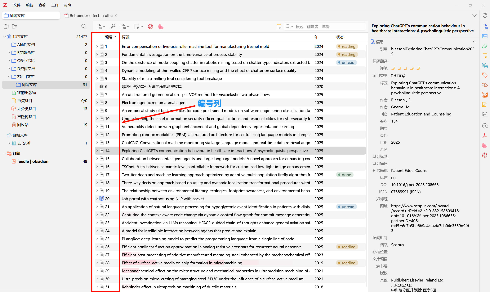

# Zotero One

[](https://www.zotero.org)
[](https://github.com/user/zotero-one/releases)
[](LICENSE)

**Zotero One** is an enhanced productivity plugin for Zotero that combines item numbering and quick preview functionality to streamline your research workflow. Fully developed using AI programming tools, vibe coding of the product.

[English](README.md) | [简体中文](doc/README-zhCN.md)

## ✨ Features

### 📋 Item Numbering

- **Sequential numbering**: Display sequential numbers for each item in your library
  

### 👁️ Quick Preview

- **Literature information preview**: After selecting a document, press the space bar to quickly preview the abstract and other information of the document without opening the file or turning your head to look at the information bar on the right
  

### 🌐 User Interface

- **Integrated column**: Seamlessly adds a numbering column to the items view
- **Multilingual support**: Available in English and Chinese
- **Modern design**: Clean, professional appearance that matches Zotero's interface
- **Customizable**: Adjustable column position and sorting options

## 🚀 Installation

### Method 1: Download XPI (Recommended)

1. Download the latest `zotero-one.xpi` from [Releases](https://github.com/user/zotero-one/releases)
2. In Zotero, go to `Tools` → `Add-ons`
3. Click the gear icon and select `Install Add-on From File...`
4. Select the downloaded XPI file
5. Restart Zotero

### Method 2: Auto-update (Coming Soon)

Auto-update functionality will be available in future releases.

## 🔧 Usage

### Item Numbering

1. After installation, a new "编号" (Number) column will appear in your items view
2. Right-click in the items area and select "Toggle Item Numbering" to enable/disable
3. Drag the column to your preferred position
4. Click the column header to sort by number

### Quick Preview

1. Select any item you want to preview
2. Press the space bar to quickly preview the document
3. Press the space bar again or ESC key to close the preview modal
4. Click the button in the top-right corner of the modal to open the PDF in a Zotero tab for in-depth reading

## 🛠️ Development

### Prerequisites

- Node.js (v16 or higher)
- npm or pnpm
- Zotero Beta (for testing)

### Setup

```bash
git clone https://github.com/user/zotero-one.git
cd zotero-one
npm install
```

### Development Commands

```bash
# Start development server with hot reload
npm start

# Build for production
npm run build

# Lint and format code
npm run lint:fix

# Release new version
npm run release
```

### Project Structure

```
zotero-one/
├── src/                    # TypeScript source code
│   ├── modules/            # Core functionality modules
│   │   ├── itemNumbering.ts    # Item numbering logic
│   │   └── quickPreview.ts     # Quick preview functionality
│   ├── utils/              # Utility functions
│   └── hooks.ts            # Lifecycle hooks
├── addon/                  # Static addon files
│   ├── content/            # UI and assets
│   ├── locale/             # Internationalization
│   └── manifest.json       # Plugin manifest
└── .scaffold/              # Build output
    └── build/
        └── zotero-one.xpi  # Built plugin file
```

## 🤝 Contributing

Contributions are welcome! Please feel free to submit issues and pull requests.

1. Fork the repository
2. Create a feature branch: `git checkout -b feature/amazing-feature`
3. Commit your changes: `git commit -m 'Add amazing feature'`
4. Push to the branch: `git push origin feature/amazing-feature`
5. Open a Pull Request

## 📝 License

This project is licensed under the AGPL-3.0 License - see the [LICENSE](LICENSE) file for details.

## 🙏 Acknowledgments

- Fully developed using AI programming tools, a product of Vibe Coding. Special thanks to AI technology development that enables someone without programming skills to create their desired software products.
- Built with [Zotero Plugin Template](https://github.com/windingwind/zotero-plugin-template)
- Powered by [Zotero Plugin Toolkit](https://github.com/windingwind/zotero-plugin-toolkit)
- TypeScript definitions from [Zotero Types](https://github.com/windingwind/zotero-types)

## 🎬 Follow My Channels

- **Bilibili**: https://space.bilibili.com/52846118
- **RedNote**: https://www.xiaohongshu.com/user/profile/5c6115700000000018009a4f?xsec_token=YBpDdQp4eCnQ3Lbgl3zmttyrXctNCrsPQG_OykwICV4J8=&xsec_source=app_share&xhsshare=CopyLink&appuid=5c6115700000000018009a4f&apptime=1751780059&share_id=fd73f6b440b349df806f843825046a96
- **YouTube**: https://youtube.com/channel/UCwcXTd0naGLe881Jn0-5m7w?si=MgxSQ9OB-shF7gC_

## 📞 Support

- **Issues**: [GitHub Issues](https://github.com/user/zotero-one/issues)
- **Discussions**: [GitHub Discussions](https://github.com/user/zotero-one/discussions)
- **Documentation**: [Plugin Documentation](https://github.com/user/zotero-one/wiki)

---

<p align="center">
  <b>Enhance your Zotero experience with Zotero One!</b><br>
  <sub>🔥 Star this repository if you find it useful!</sub>
</p>
